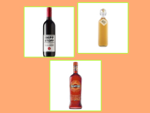
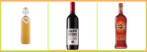

# Category-Image-Generator

This plugin generates images for categories which doesn't have a image.

## Available 'modes'

*Colored background and borders are only for demonstration purposes*

"Offset"

"In row"

* ordered by height: smallest, highest, mid-height
* vertical centered

"In row - cropped"

* ordered by height: smallest, highest, mid-height
* vertical centered

## How images will be generated

The generated image is based on random products of the category and their subcategories (down to 5th level of the category).

* The max amount of images which should be used is configurable (1 to 3, 3 is default)
* Images of articles which are a direct child of the category will be preferred - only when there are not enough
  articles with images (config max-count) - the articles of subcategories down to level 5 will be checked

The plugin uses the jtl-shop default tables for the images, so

* no custom mechanism was provided for image handling
* no performance impact for the customer
* configured images via jtl-wawi will win

Additional Informations, like **troubleshooting**, you can find
on https://github.com/things4it/JTLShop-Plugin-CategoryImageGeneration/wiki.
The project is open-source - so you are welcome to check the code and conribute. 
If you find a bug or you have a improovement - just create a issue or create a pull-request.

## Cronjob

By default missing images will be checked every day at 00:00 via cron-job. The cron-job is named as "Kategoriebilder
generieren (Plugin)"/"Generate category images (Plugin)"

## Plugin Settings

Changes at settings will trigger the regeneration of all generated images!
Before regeneration all generated images will be deleted - so for a short time you have no category images!

## Re-Generate images for specific categories

You can generate images for specific categories via the plugin settings tab "Bild neu generieren (einzeln)"/"Re-Create a
category image".

**Note**: if you "override" a image which was provided by the jtl-wawi sync - it will be overridden by the next sync.

## Supported image types

Article images could be type of

* jpeg
* gif
* png

# Requirements

* Minimal tested php-version is ``7.3.28``
* PHP-GD have to be installed with support for jpeg, png and gif
  * Example for PHP-GD: ``apt install php7.4-gd``
  * ...
* JTL Cron-Jobs should be triggered by a native system cronjob
  * See the recommendation from JTL
    in https://guide.jtl-software.de/jtl-shop/systemverwaltung/aufgabenplaner-fuer-exporte-einrichten/#wie-und-wann-werden-aufgaben-im-aufgabenplaner-abgearbeitet

# Installation

When you install this plugin out of a provided "release-bundle" - maybe you clone or download this repo, ensure the
plugin-folder is named as ``t4it_category_image_generation``
